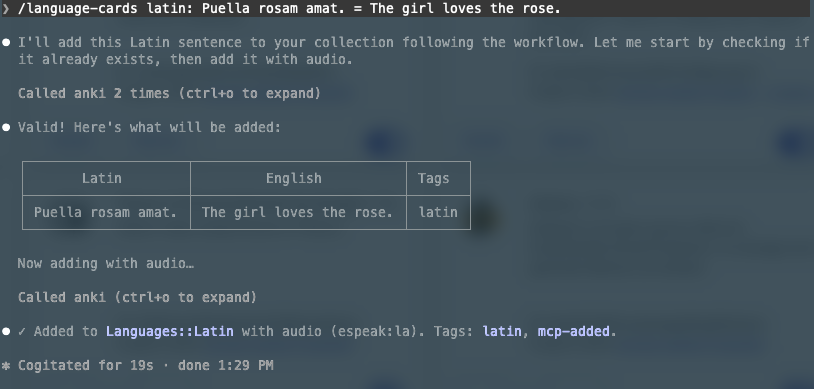
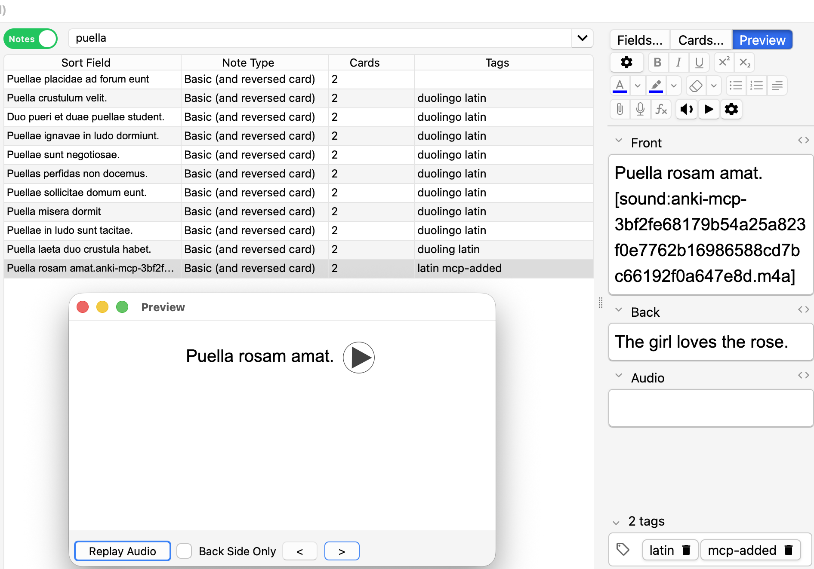

# anki-mcp

[](https://github.com/ikristina/anki-mcp/actions/workflows/ci.yml)

An MCP server that gives agents (Claude Code, Claude Desktop, …) access to your local Anki collection via
[AnkiConnect](https://ankiweb.net/shared/info/2055492159).

Blog post about building it: [ikristina.github.io/blog/anki-mcp-server](https://ikristina.github.io/blog/anki-mcp-server/).

| Tool | What it does |
|---|---|
| `list_decks` | Decks with counts and `source` (`anki` / `yanki` = synced from Obsidian / `mixed`) |
| `describe_deck` | Works out a deck's format: note types, fields, audio field and its source, code values (e.g. WordType), templates, tag patterns, samples |
| `search_notes` | Anki search syntax, paginated compact previews |
| `get_notes` | Full content for specific note ids |
| `get_weak_cards` | Most-forgotten cards (lapses, then ease), optionally per deck |
| `get_deck_profile` / `set_deck_profile` | Your saved per-deck conventions (note type, audio field + voice, how to fill each field, tags, rules). Stored in a local JSON file, not in Anki |
| `add_audio` | Adds pronunciation audio to *existing* notes that lack it; dry run by default, batches of ≤50, skips notes that already have audio |
| `add_notes` | Batch add with validation, `dry_run`, duplicate check, auto-tag `mcp-added`, optional free TTS audio; refuses Yanki-owned decks |

Skills in `.claude/skills/`:
- `flashcards` routes cards: technical/interview topics become markdown in the Obsidian vault (synced by Yanki), and everything else goes straight to Anki.
- `language-cards` (`/language-cards <words>`) adds vocabulary with pronunciation audio to any language deck, following that deck's profile. If a deck has no profile yet, it works one out with `describe_deck` and asks you to confirm it.

## Installation

### Requirements

- macOS (the offline voices and audio conversion use the built-in `say` and `afconvert`)
- [uv](https://docs.astral.sh/uv/) (`brew install uv`); it installs Python 3.11+ for you if needed
- [Anki](https://apps.ankiweb.net/) desktop
- [Claude Code](https://claude.com/claude-code)

### 1. Anki + AnkiConnect

1. In Anki: **Tools → Add-ons → Get Add-ons…**, enter code `2055492159`, and restart Anki.
2. Keep Anki open whenever you use the server. AnkiConnect listens on `http://127.0.0.1:8765`.

### 2. eSpeak NG (for Latin audio)

Google's voices have no real Latin, so Latin uses eSpeak NG's Latin voice. It's robotic, but the pronunciation is correct.

```bash
brew install espeak-ng
```

Check it: `espeak-ng --voices=la` should list `Latin`.

### 3. The server

```bash
git clone <this repo> ~/Projects/anki-mcp   # or copy the folder
cd ~/Projects/anki-mcp
uv sync
uv run python scripts/smoke.py              # read-only check over stdio; Anki must be running
```

### 4. Register with Claude Code

```bash
claude mcp add anki --scope user -- uv --directory /absolute/path/to/anki-mcp run anki-mcp
```

Then start a new Claude Code session and run `/mcp`: `anki` should show as connected.
`--scope user` makes the tools available in every project. The skills only load when Claude Code runs inside this folder,
unless you copy `.claude/skills/*` to `~/.claude/skills/`.

### Other agents (Claude Desktop, Cursor, VS Code, Codex, Gemini CLI, …)

MCP is agent-agnostic, so any MCP client can run this server. No clone is needed: `uvx` builds it straight from GitHub.
Steps 1–2 (Anki + AnkiConnect, eSpeak) still apply.

The command every client runs:

```bash
uvx --from git+https://github.com/ikristina/anki-mcp anki-mcp
```

GUI apps often don't inherit your shell's `PATH`. If the server fails to start, replace `uvx` with its absolute path
(`which uvx`, e.g. `/Users/you/.local/bin/uvx`).

**Claude Desktop** (`~/Library/Application Support/Claude/claude_desktop_config.json`), **Cursor** (`~/.cursor/mcp.json`),
**Windsurf**, **Gemini CLI** (`~/.gemini/settings.json`), and most other clients use the `mcpServers` format:

```json
{
  "mcpServers": {
    "anki": {
      "command": "uvx",
      "args": ["--from", "git+https://github.com/ikristina/anki-mcp", "anki-mcp"]
    }
  }
}
```

**VS Code / GitHub Copilot** (`.vscode/mcp.json`) uses `servers`:

```json
{
  "servers": {
    "anki": {
      "type": "stdio",
      "command": "uvx",
      "args": ["--from", "git+https://github.com/ikristina/anki-mcp", "anki-mcp"]
    }
  }
}
```

**OpenAI Codex CLI** (`~/.codex/config.toml`):

```toml
[mcp_servers.anki]
command = "uvx"
args = ["--from", "git+https://github.com/ikristina/anki-mcp", "anki-mcp"]
```

The tools work the same everywhere. The **skills** (`.claude/skills/`) are Claude Code's format; with other agents, copy
the relevant `SKILL.md` body into that agent's rules/instructions file. Deck-specific conventions live in deck profiles
(below), not in the skills, so the skills work with any collection.

### Optional

- `ANKI_CONNECT_URL`, if AnkiConnect isn't on `http://127.0.0.1:8765`
  (`claude mcp add anki -e ANKI_CONNECT_URL=http://... -- ...`).
- Obsidian with the Local REST API plugin and an Obsidian MCP server, needed only for the `flashcards` skill's Yanki path.

## Deck profiles

Some things `describe_deck` can't infer: which voice a deck uses, which field is spoken, "nouns include the article".
Save them once as a deck profile, and every session and agent follows them:

- File: `~/.config/anki-mcp/profiles.json` (override with `ANKI_MCP_PROFILES=/path/to/file.json`). It's plain JSON, so
  edit it by hand if you like. Nothing is written to your Anki collection.
- `set_deck_profile` checks each profile against Anki before saving: the deck and note type must exist, the field names
  must belong to that note type, and the voice must work.
- Agents are told to save a profile only after you confirm it. The `language-cards` skill proposes one the first time
  you add to a deck that has none.
- [`examples/profiles.json`](examples/profiles.json) holds my Spanish, French and Latin profiles. To start from them,
  copy the file to `~/.config/anki-mcp/profiles.json` and rename the decks to match yours.

## Audio voices

`add_notes` takes `audio: {"field": ..., "voice": ...}`. All engines are free:

| Voice string | Engine | Needs | Used for |
|---|---|---|---|
| `es-MX`, `fr`, `de`, `pt-BR`, … | Google Translate (gTTS) | internet | Spanish, French (the same voices HyperTTS's GoogleTranslate service uses) |
| `espeak:la` | eSpeak NG | `brew install espeak-ng` | Latin |
| `macos:Alice` (any `say -v '?'` voice) | macOS `say` | macOS | natural offline voices |

Google files are MP3; the offline engines produce M4A (AAC). Anki plays both.

## Development

```bash
uv run pytest -q                # unit tests: fake in-memory AnkiConnect, no Anki/network needed (runs in CI)
uv run python scripts/smoke.py  # end-to-end over stdio against your real collection (read-only; Anki must be running)
```

See [LEARNINGS.md](LEARNINGS.md) for design notes.


## Example use




